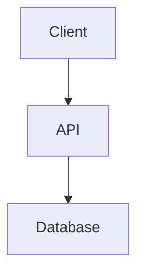

# OPENAKTA Documentation Format

**Date:** 2026-03-16
**Status:** ADOPTED
**Purpose:** Define documentation standards for OPENAKTA project

---

## 📋 Overview

OPENAKTA uses a **structured documentation approach** with:

- **Machine-parseable** metadata (YAML frontmatter)
- **Human-readable** content (Markdown)
- **Validated** structure (JSON Schema)
- **Traceable** links (bidirectional references)

---

## 📁 Documentation Types

| Type | Location | Format | Validation |
|------|----------|--------|------------|
| **Business Rules** | `docs/business_rules/` | Markdown + YAML | JSON Schema |
| **Architecture** | `docs/architecture/` | Markdown | Linting |
| **API Documentation** | `docs/api/` | OpenAPI + Markdown | OpenAPI Validator |
| **User Guides** | `docs/guides/` | Markdown | Linting |
| **Research** | `research/` | Markdown | Linting |
| **Planning** | `planning/` | Markdown | Linting |

---

## 🏷️ Business Rules

Business rules are documented in Markdown with YAML frontmatter:

- **Location:** `docs/business_rules/`
- **Format:** Markdown + YAML frontmatter
- **Validation:** JSON Schema + custom script
- **Links:** Bidirectional (YAML `applies_to` + code `@req` annotations)

### Example

```markdown
---
rule_id: "AUTH-001"
title: "User Authentication Protocol"
category: "Security"
severity: "Critical"
applies_to:
  - "src/auth/login.rs"
  - "src/middleware/auth.rs"
related_rules:
  - "AUTH-002"
---

# User Authentication Protocol

## Rule Definition
All users must successfully authenticate...

## Validation Criteria
1. Token must not be expired
2. Token signature must match...
```

**See:** [`BUSINESS-RULE-SCHEMA.md`](./BUSINESS-RULE-SCHEMA.md) for full specification.

### Validation

```bash
# Validate all business rules
./scripts/validate-business-rules.sh
```

---

## 🏛️ Architecture Documentation

Architecture documentation describes system design:

- **Location:** `docs/architecture/`
- **Format:** Markdown with diagrams (Mermaid)
- **Validation:** Link checking

### Example Structure

```markdown
# Component Name

## Overview
Brief description of the component.

## Architecture



## Interfaces
- API endpoints
- Events published/consumed

## Data Model
- Key data structures
- Database schema references
```

---

## 📡 API Documentation

API documentation describes endpoints:

- **Location:** `docs/api/`
- **Format:** OpenAPI 3.0 + Markdown
- **Validation:** OpenAPI validator

### Example Structure

```yaml
openapi: 3.0.0
info:
  title: OPENAKTA API
  version: 1.0.0
paths:
  /api/v1/users:
    get:
      summary: List users
      responses:
        '200':
          description: Success
```

---

## 📖 User Guides

User guides help users accomplish tasks:

- **Location:** `docs/guides/`
- **Format:** Markdown
- **Validation:** Link checking, spell checking

### Example Structure

```markdown
# Guide Title

## Prerequisites
What you need before starting.

## Steps
1. First step
2. Second step
3. Third step

## Troubleshooting
Common issues and solutions.
```

---

## 🔬 Research Documentation

Research documents capture investigation findings:

- **Location:** `research/`
- **Format:** Markdown
- **Validation:** Link checking

### Example Structure

```markdown
# Research Topic

## Question
What we're investigating.

## Methodology
How we investigated.

## Findings
What we discovered.

## Recommendation
What we should do based on findings.
```

---

## 📋 Planning Documentation

Planning documents track project progress:

- **Location:** `planning/`
- **Format:** Markdown
- **Validation:** Link checking

### Example Structure

```markdown
# Phase/Project Name

## Status
Current status.

## Goals
What we're trying to achieve.

## Progress
What we've completed.

## Blockers
What's blocking progress.

## Next Steps
What we're doing next.
```

---

## ✅ Validation

### Automated Validation

```bash
# Validate business rules
./scripts/validate-business-rules.sh

# Validate links (using lychee)
lychee docs/**/*.md

# Validate Markdown (using remark)
remark docs/**/*.md
```

### Manual Review

- All new documentation requires PR review
- Business rules require security review
- API documentation requires API owner review

---

## 🔗 Cross-References

### Linking Between Documents

```markdown
**Relative links:**
- [`BUSINESS-RULE-SCHEMA.md`](./BUSINESS-RULE-SCHEMA.md)
- [`../planning/shared/GRAPH-WORKFLOW-DESIGN.md`](../planning/shared/GRAPH-WORKFLOW-DESIGN.md)

**Absolute links (avoid):**
- Use relative paths for internal links
```

### Code ↔ Documentation Links

**In documentation (YAML):**
```yaml
applies_to:
  - "src/auth/login.rs"
```

**In code (Rust annotations):**
```rust
/// @req AUTH-001 — User Authentication Protocol
pub fn authenticate_user(...) { }
```

---

## 📊 Documentation Metrics

| Metric | Target | Measurement |
|--------|--------|-------------|
| Schema Compliance | 100% | % of docs passing validation |
| Link Health | >95% | % of valid links |
| Coverage | >80% | % of critical paths documented |
| Freshness | <90 days | % of docs updated in 90 days |

---

## 🎯 Best Practices

1. **Write for humans, validate for machines** — Content should be readable, structure should be valid
2. **Keep documentation close to code** — Use relative paths, update together
3. **Use consistent terminology** — Define terms in glossary
4. **Include examples** — Show, don't just tell
5. **Link bidirectionally** — Docs → Code and Code → Docs
6. **Review regularly** — Stale documentation is worse than no documentation

---

**This format enables CONSISTENT, VALIDATED, TRACEABLE documentation across OPENAKTA.**
