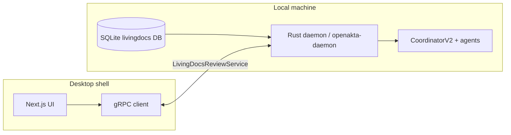

# Plan 6: Conflict Resolution (SSOT) and Notifications UI — Architectural Specification

**Document ID:** `plan-06-ssot-conflict-resolution-ui-spec`  
**Status:** Implemented backend + live desktop bridge  
**Last updated:** 2026-03-21  

**Depends on:** Plan 5 (`openakta-docs` confidence/changelog, `SqliteJobQueue` / `livingdocs_reconcile_reviews`, `LivingDocsProcessor`)

**Terminology:** “**bunqueue**” in product language maps to the **local SQLite-backed LivingDocs review queue** (`livingdocs_reconcile_reviews`, related drift and audit tables). The UI must not read SQLite directly; only the Rust runtime exposes data via **LivingDocsReviewService** (gRPC).

---

## 1. Architecture and IPC data flow design

### 1.1 Trust boundaries

- **Single source of persistence:** SQLite remains authoritative for **pending human reviews** (`livingdocs_reconcile_reviews` with `status = pending`).
- **UI never opens the DB file.** All reads/writes go through **daemon gRPC** on the **MCP server port** (same process as `GraphRetrievalService` / `ToolService`), alongside those services.
- **CoordinatorV2** (`openakta-agents`) executes **Option B** (code change) as a **CodeModification** mission and the review row persists the resulting `patch_receipt_id` (stable hash over the receipt payload).

### 1.2 Notification model (non-intrusive)

- No modal on drift detection; **badge count** and optional **toast** (dismissible).
- **Dedicated “Review queue”** surface: sidebar tab or panel listing `ReviewRequired` items.
- **Do-not-disturb:** optional user setting (future).

**Minimum data:** `pending_review_count`, list with `review_id`, `report_id`, `created_at_ms`, `confidence_score`, primary doc path, `highest_severity`.

**Transport:** **Polling** unary RPCs (`GetPendingReviewCount`, `ListPendingReviews`); optional **`SubscribeReviewQueue`** stream in a later revision.

### 1.3 Resolution command flow

1. UI calls **GetReviewDetail(review_id)** → daemon joins review row + drift report + flags.
2. User chooses **Option A (SSOT = code / update docs)** or **Option B (SSOT = docs / update code)** — see proto `SsotChoice`.
3. UI calls **SubmitResolution** with `client_resolution_id` (UUID) for idempotency.
4. gRPC persists the intent on `livingdocs_reconcile_reviews` (`*_queued` status + `server_resolution_id`) and returns only after the engine-owned follow-up reaches a terminal state or times out.
5. `LivingDocsEngine` claims queued review resolutions from SQLite, marks them `*_running`, and executes the follow-up:
   - **Option A / `UPDATE_DOC`**: reuse the Plan 5 changelog path (`ToonChangelogPayload`, `append_changelog_entry`, `write_external_changelog_file`, alternate-index commit when available), then persist `toon_changelog_entry_id`.
   - **Option B / `UPDATE_CODE`**: build a focused code-resolution mission, run it through **CoordinatorV2**, and persist a stable `patch_receipt_id`.
6. Terminal review states are explicit: `resolved_with_doc_update`, `resolved_with_code_update`, `doc_update_failed`, `code_update_failed`.

---

## 2. Frontend UX and UI blueprint (React / Next.js)

**Location:** `apps/desktop/components/review/` — live queue surface, badge, resolver modal, and diff panel.

**Desktop bridge:** Electron main owns the Node gRPC client (`@grpc/grpc-js` + `@grpc/proto-loader`) and exposes typed IPC/preload methods. React never opens sockets directly.

**Global state:** workspace root, `pendingCount`, `items[]`, `detail`, `resolutionInFlight`, `daemonError`, optional dismissible banner.

**Handlers:** `handleUpdateDoc(reviewId)` → `SubmitResolution(..., UPDATE_DOC)`; `handleUpdateCode(reviewId)` → `SubmitResolution(..., UPDATE_CODE)`.

---

## 3. Backend bridge contracts (gRPC)

**Proto:** [`aktacode/proto/livingdocs/v1/review.proto`](../../proto/livingdocs/v1/review.proto)

**Rust:** Generated in `openakta-proto` under `livingdocs::v1`. **Server:** `openakta-daemon` `LivingDocsReviewServiceImpl`.

**RPCs:** `ListPendingReviews`, `GetPendingReviewCount`, `GetReviewDetail`, `SubmitResolution`.

---

## 4. Cross-cutting requirements

- **Security:** bind to localhost (same as MCP).
- **Privacy:** local-only by default.
- **Observability:** structured logs for `review_id`, `report_id`, `choice`, `outcome`.
- **Workspace ACL:** daemon path checks canonicalize/normalize before comparison to avoid false mismatches on `workspace/.` or equivalent local aliases.

---

## 5. Acceptance checklist

- [x] Proto definitions for §3 messages and enums.
- [x] UI reads queue only via daemon; badge count matches `pending` rows.
- [x] Conflict UI forces explicit SSOT before action.
- [x] Option A triggers TOON/doc pipeline end-to-end and returns `toon_changelog_entry_id`.
- [x] Option B triggers CoordinatorV2 with persisted `patch_receipt_id`.
- [x] Drift view shows expected vs actual excerpts derived from doc/code files.

---

## Related

| Resource | Role |
|----------|------|
| [../ARCHITECTURE-LEDGER.md](../ARCHITECTURE-LEDGER.md) | Ledger |
| Plan 5 implementation | Confidence + queue + TOON |
